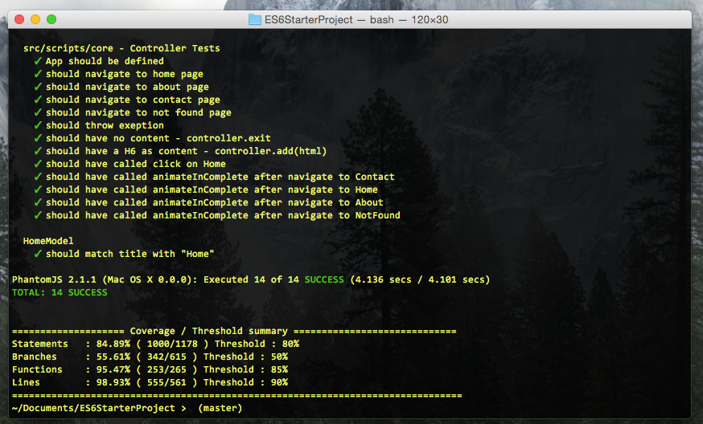

# ES6 Starter Project

Ready to go ES6(SPA) project starter with Tests and Coverage.

[](https://travis-ci.org/iondrimba/es6starterproject) [](https://ci.appveyor.com/project/iondrimba/es6starterproject) [](https://coveralls.io/github/iondrimba/es6starterproject?branch=master)


#### Requires:

* NodeJs
* Gulp

## Installation

```sh
 git clone https://github.com/iondrimba/es6starterproject.git 
 cd es6starterproject
 npm install
 gulp
```

### [Live demo]

#### GOAL:
Reduce time spent by developers looking to work today with all the new ES6 features, it also includes Tests and Coverage. I chose to leave it simple as possible (no MV* Framework dependency).


#### TODO:

* Write more tests



#### Features:

* ES6 ready
* SemVer (Automated package and files versioning)
* Router system with pushstate (page.js)
* Templating engine (handlebars.js)
* Tests (Jasmine + karma)
* Coverage (Coveralls)
* CI (Travis)
* Module system CommonJs (browserify)

> In order to test if Pushstate is working
> you have to host it on apache so it can reads the .htaccess file

#### Testing:

* $ npm test

#### Includes:

* ES6 transpile via Babel
* BrowserSync
* Browserify
* Karma 
* SemVer
* Jasmine 
* Code Coverage
* Sass
* ESLint
* Scss Lint (Requires Ruby and [scss-lint])
* Imagemin (images optimization)
* Uglify
* Watch
* Html-Min
* Post-Css (autoprefixer)

####Gulp Tasks:

* gulp (default)
* gulp deploy (run tasks without browser-sync and watch)
* gulp optimize (run optimization tasks)
* gulp bump-patch / minor / major (update files with version number)

####Semantic Versioning:

The bump-versions tasks should be executed after your deploy and optimize task.
The task will:

1. Rename the file app.js to app.version.js
2. Rename the file app.css to app.version.css
3. Will update the index.html with the new file references.

#### Structure:

````bash
├── public/
│    ├─── css/ 
│    ├─── js/
│    ├─── images/
│    ├─── .htaccess
│    └─── index.html
│
│── spec/(jasmine spec files)
│
│── src/
│    ├── images/
│    ├── scripts/
│	   │    ├─── core/ 
│	   │    ├─── models/
│	   │    ├─── partials/
│	   │    ├─── views
│	   │    └─── app.js
│	   │
│	   ├── scss/
│	   │    ├─── components/ 
│	   │    ├─── partials/
│	   │    ├─── views/
│	   │    └─── app.scss
│	   │
│    └── templates/
│
│── tasks/
│
│── .gitignore
│── .travis.yml
│── gulpfile.js
│── karma.conf.js
│── LICENSE
│── lint.yml
│── package.json
└── README.md
````

[scss-lint]:<https://github.com/brigade/scss-lint#installation>
[Live demo]:<http://iondrimba.github.io/es6starterproject/>
